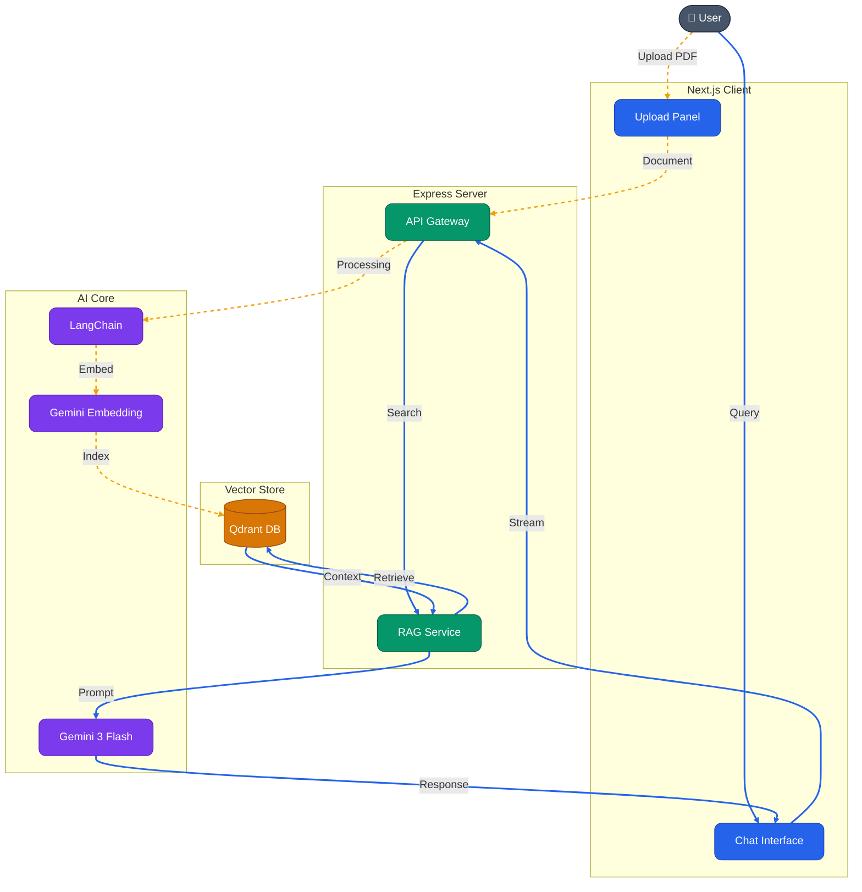

# 🧠 RAG-Powered AI PDF Chat

A modern, high-performance Retrieval-Augmented Generation (RAG) application that allows users to upload PDF documents and engage in context-aware conversations with an AI assistant. Built with **Next.js 16**, **Express 5**, and **Google Gemini**.


---

## 🚀 Features

- **📄 PDF Ingestion**: Advanced PDF parsing using LangChain's `PDFLoader` and `pdf-parse`.
- **🔍 Semantic Search**: Uses **Qdrant Vector Store** with **Gemini Embedding 001** for high-accuracy retrieval.
- **💬 Streaming Chat**: Real-time interaction with **Google Gemini 3 Flash** for ultra-fast reasoning.
- **🛡️ Strict Grounding**: Ensures AI responses stay within the document's context to prevent misinformation.
- **🎨 Modern UI/UX**: Sleek, animated interface built with **Shadcn UI**, **Tailwind CSS v4**, and **Framer Motion**.
- **🚀 Scalable Backend**: Built with **Express 5** for modern, asynchronous request handling and **Zod** for strict type safety.

---

## 🏗️ Tech Stack

### Frontend (`/client`)
- **Framework**: Next.js 16 (React 19)
- **Styling**: Tailwind CSS v4 + PostCSS
- **Animations**: Framer Motion
- **Components**: Shadcn UI + Lucide React
- **Data Fetching**: Axios + Streaming API Support
- **Feedback**: Sonner (Toasts)

### Backend (`/server`)
- **Runtime**: Node.js + TypeScript
- **Framework**: Express 5 (Alpha)
- **Orchestration**: LangChain
- **AI Model**: Google Generative AI (Gemini 3 Flash)
- **Vector Database**: Qdrant
- **Embeddings**: Google Gemini Embedding (001)
- **Validation**: Zod (for Environment and API Schema)
- **Security**: Helmet, CORS, Rate Limiting

---

## 🏗️ System Architecture



---

## 🚦 Getting Started

### Prerequisites
- Node.js (v20+)
- Qdrant Instance (Local or Cloud)
- Google Gemini API Key

### Installation

1. **Clone the repository**
   ```bash
   git clone https://github.com/GitCoder052023/RAG.git
   cd RAG
   ```

2. **Setup Backend**
   ```bash
   cd server
   pnpm install
   cp .env.example .env
   # Add your credentials to .env (see below)
   npm dev
   ```

3. **Setup Frontend**
   ```bash
   cd client
   pnpm install
   pnpm dev
   ```

---

## 📖 API Endpoints

| Method | Endpoint | Description |
| :--- | :--- | :--- |
| `POST` | `/api/docs/upload` | Upload and vectorize a PDF file |
| `GET` | `/api/chat/stream` | Stream a chat response based on query |
| `GET` | `/api/health` | Check server status |

---

## 🛡️ Environment Variables

### Server
- `PORT`: Server port (default: 8000)
- `GOOGLE_API_KEY`: Your Google AI API key
- `QDRANT_URL`: URL to your Qdrant instance
- `QDRANT_COLLECTION`: Collection name for vectors
- `QDRANT_API_KEY`: (Optional) Qdrant Cloud API key
- `NODE_ENV`: development | production | test
- `ALLOWED_ORIGINS`: CORS configuration (default: *)

---

## 📄 License
This project is licensed under the MIT License - see the [LICENSE](LICENSE) file for details.

---

Developed with ❤️ by [Your Name/Team]
